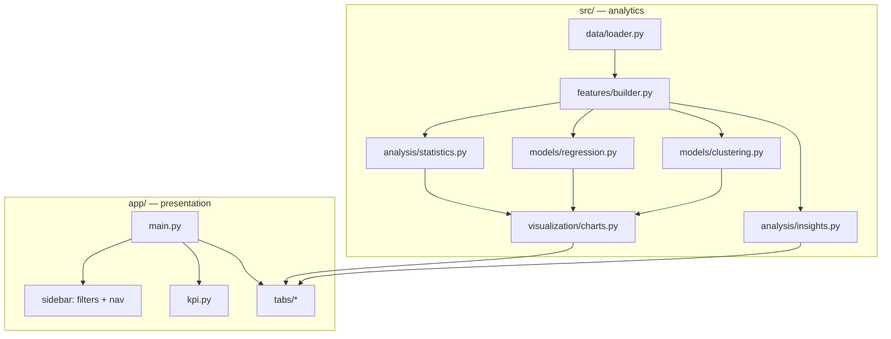
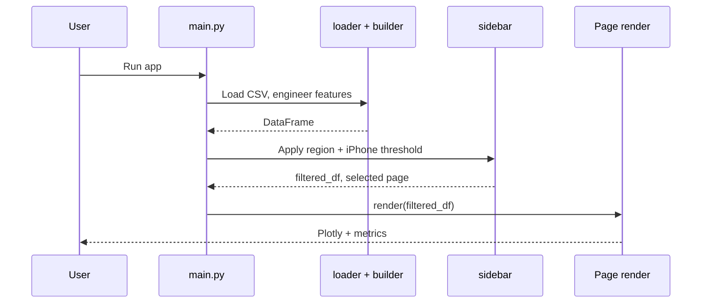
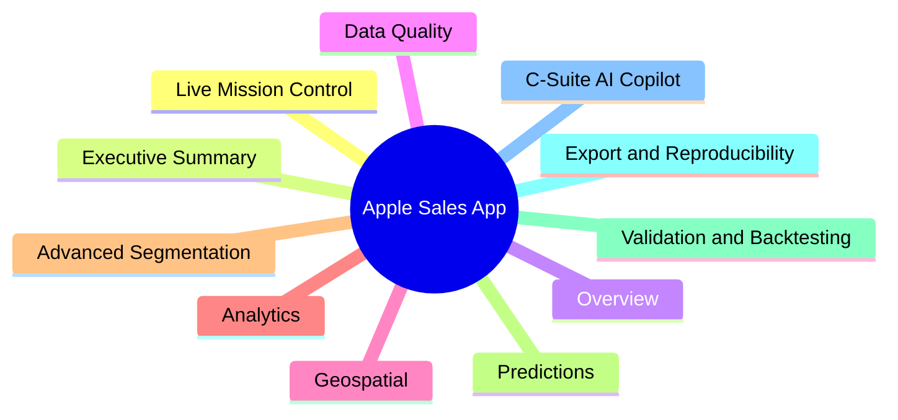

# Case Study: Apple Product Sales — Analytics & Decision-Support Dashboard

**Comprehensive Data Analysis & Visualization**  
*Streamlit · pandas · scikit-learn · Plotly · SciPy*

This document describes the **actual design and implementation** of the project: a single-user **Streamlit** application backed by a **tabular CSV**, with analytics isolated under `src/` and presentation under `app/`. It complements the repository **[README](README.md)** with problem framing, architecture, and honest scope boundaries.

---

## 1. Problem statement and goals

**Context.** Regional sales data for hardware categories (iPhone, iPad, Mac, Wearables) and **Services revenue** is often viewed in static spreadsheets or simple charts. Stakeholders want to move from descriptive totals toward **comparative statistics**, **segmentation**, **predictive models**, and **repeatable exports**—without standing up a full separate BI stack for a portfolio or classroom setting.

**Objectives for this build.**

| Goal | How it is addressed in code |
|------|-----------------------------|
| Single source of truth | One file: `data/raw/apple_sales_2024.csv`, loaded and column-normalized in `src/data/loader.py`. |
| Reusable analytics | Logic in `src/` (statistics, models, charts, insights), not embedded only in button callbacks. |
| Interactive exploration | Streamlit sidebar filters (regions, minimum iPhone volume) and multiple focused views (`app/components/tabs/`). |
| Trust and reproducibility | Validation tab with cross-validation and time-series splits; Export tab writes `joblib` + JSON + CSV under `src/models/saved/`. |
| Guided use | “Launch Guided Demo” in `app/components/demo.py` walks users through the workflow when presenting. |

**Non-goals (explicit).** This is **not** a production multi-tenant SaaS, **not** a live data feed from Apple or retailers, and **not** an LLM-backed chat product. The “C-Suite AI Copilot” routes **natural-language-style prompts by keyword** to the same deterministic metrics and recommendation functions used elsewhere.

---

## 2. Data pipeline and quality

### 2.1 Ingestion

`load_data()` reads the CSV, strips header names, and assigns stable internal columns: `State`, `Region`, `iPhone_Sales`, `iPad_Sales`, `Mac_Sales`, `Wearables_Sales`, `Services_Revenue`. Loading is wrapped in **`@st.cache_data`** to avoid repeated disk I/O on reruns.

`get_data_quality()` (same module) returns record count, missing values, duplicate rows, dtypes, and memory usage—used by the **Data Quality** view.

### 2.2 Feature engineering

`src/features/builder.py` adds:

- `Total_Product_Sales` — sum of the four hardware columns  
- `Revenue_Per_Unit` — `Services_Revenue / Total_Product_Sales`  
- `iPhone_Market_Share` — iPhone share of total hardware  

These derived fields power ratios, rankings, and model features.

### 2.3 Data Quality tab (what is real vs. illustrative)

The **Data Quality** tab (`app/components/tabs/data_quality.py`) implements:

- A **heuristic reliability index** from completeness, z-score outliers (>3σ), negative values, and zero-variance columns.  
- **Box plots** and **IQR** bounds (1.5×IQR rule) with suggested mitigation narratives (prune, winsorize, median imputation) when thresholds are crossed—these are **UI guidance strings**, not automatic mutations applied to the dataframe in the background.  
- A **simulated drift** comparison: a resampled, jittered slice of `Services_Revenue` against the mean to demonstrate how a drift alarm would behave—labeled in spirit as synthetic in the implementation.

For a rigorous case study, treat **loader + builder** as the canonical data path; treat **drift simulation** as a **pedagogical demo**, not live monitoring.

---

## 3. System architecture

### 3.1 Layered layout

### 3.2 Runtime sequence

### 3.3 Navigation map

All pages share the **same filtered dataframe** so behavior stays consistent when filters change.

---

## 4. Analytics and modeling (by capability)

### 4.1 Statistical inference

`src/analysis/statistics.py` exposes **Welch t-test** (`ttest_ind`, `equal_var=False`), **one-way ANOVA** (`f_oneway`), and **Pearson correlation**. The **Analytics** tab connects these to regional and metric comparisons—appropriate for **exploratory** analysis on cross-sectional rows, not for causal claims without domain design.

### 4.2 Clustering

`src/models/clustering.py`:

- Scales numeric features with `StandardScaler`.  
- Supports **K-Means**, **AgglomerativeClustering**, and **DBSCAN**.  
- Optional **silhouette-driven choice of k** (for K-Means and agglomerative when the sample is large enough).  
- **`generate_cluster_profiles`** maps centroids vs global means to short labels and strategy-style text.

Outputs include **3D scatter** (via `charts.plot_3d_clusters`) and cluster summaries.

### 4.3 Regression and prediction UI

`src/models/regression.py` includes:

- Simple and multiple **linear** regression.  
- **Polynomial** pipelines (`StandardScaler` → `PolynomialFeatures` → `LinearRegression`).  
- **Random Forest** and **Gradient Boosting** inside `Pipeline` with `StandardScaler` and polynomial preprocessing where applicable.  
- **`compare_models_cv`** — GridSearchCV across model families (implemented; **not currently wired** to a tab—available for extension).

The **Predictions** tab:

- Auto-selects features using correlation and a quick **RandomForest** feature-importance pass.  
- Compares models, shows **actual vs predicted** and **residuals**.  
- Runs an **ARIMA** example on a **resampled** series of `Services_Revenue` because the CSV has **no calendar column**—useful to show the API, **not** a true fiscal forecast.  
- Exposes **sliders** for “what-if” predictions.  
- Runs **`scipy.optimize.minimize`** with **SLSQP** and a **linear sum constraint** on hardware units to maximize predicted Services revenue under the **currently selected** fitted model.

### 4.4 Validation and backtesting

`app/components/tabs/validation.py`:

- **K-fold `cross_validate`** on a Random Forest pipeline (trust-style metrics).  
- On-demand **5-fold cross-validation** across linear, RF, and GB pipelines.  
- **`TimeSeriesSplit`** forward-chaining on the row-ordered frame: a **reasonable** way to stress temporal ordering when no real dates exist, but still **not** true calendar forecasting.  
- A **band-style visualization** comparing predictions to held-out points with an approximate **±1.96×RMSE** band.

### 4.5 Export and reproducibility

`app/components/tabs/export.py` trains a **Random Forest** pipeline on the active features, saves **`joblib`**, emits a **JSON** snapshot (timestamp, feature list, hyperparameters from the fitted estimator), and can attach **prediction CSV** outputs. This supports **“train once, download artifacts”** workflows for notebooks or batch jobs.

---

## 5. Insight layer (`src/analysis/insights.py`)

The project generates **IF–THEN style recommendations** using:

- Linear regression coefficients between selected hardware columns and `Services_Revenue`.  
- Regional aggregates of efficiency (`Services_Revenue` / `Total_Product_Sales`).  
- Wearables vs iPhone **attach-rate** heuristics.

**Dollar figures** are derived from these formulas and scaling (e.g. millions). They are **illustrative** outputs for narrative and UI demonstration; they are **not** audited financial projections. The same function backs **Mission Control**, **Executive**-style summaries, and the **Copilot** when users ask for strategy or reports.

---

## 6. C-Suite AI Copilot and Mission Control (scope)

| Component | Implementation reality |
|-----------|-------------------------|
| **C-Suite AI Copilot** (`app/components/tabs/ai_assistant.py`) | **Keyword routing** on the user message (`risk`, `report`, `strategy`, etc.). Responses pull **region-level stats** or **`generate_business_recommendations`**. No external LLM API. |
| **Live Mission Control** (`app/components/tabs/live_mission_control.py`) | Aggregated KPIs, **synthetic sparklines** (deterministic RNG with fixed seed), recommendations, and anomaly-style callouts. **Not** a live telemetry backend. |

This distinction matters for academic integrity and portfolio reviewers: the value is **integrated analytics in one app**, not proprietary NLP or real-time feeds.

---

## 7. Visualization and UX

- **Plotly** charts share a dark template and palette via `src/visualization/charts.py` (`apply_minimal_styling`).  
- **`app/components/styles.py`** applies global Streamlit CSS for a consistent dark, card-like layout.  
- **Sidebar**: region multiselect, minimum iPhone sales slider, CSV export of the filtered table, **Guided Demo** that can lock navigation during a walkthrough.

---

## 8. Limitations and ethical notes

1. **Data**: The CSV is a **toy / stylized** dataset for analysis exercises; it does not represent Apple’s official reporting.  
2. **Generalization**: Many training metrics are **in-sample** unless the user relies on the **Validation** tab; prefer reported **CV** and **time-series split** metrics for generalization.  
3. **Recommendations**: Business text should be read as **structured storytelling**, not compliance-checked advice.  
4. **Unused code**: `compare_models_cv` in `regression.py` is a natural extension point for a future “model comparison” panel.

---

## 9. Conclusion

The project delivers a **coherent end-to-end analytics workflow** in one repository: **ingest → engineer features → explore → model → validate → export**, with a **decoupled `src/` / `app/` split** that keeps the codebase maintainable. It is best positioned as a **portfolio or teaching artifact** that demonstrates statistics, unsupervised learning, supervised regression, constrained optimization, and reproducible exports—**with clear boundaries** on what is simulated, heuristic, or illustrative versus what is standard machine learning practice.

For setup and commands, see **[README.md](README.md)**. For a visual walkthrough of the app, see **[APP_GUIDE.md](APP_GUIDE.md)**. For exploratory work outside the app, see the companion notebook **`Comprehensive Data Analysis and Visualization of Apple Product Sales.ipynb`**.
