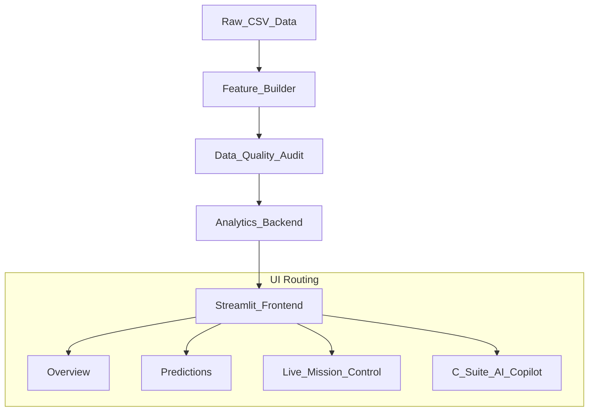

#  Case Study: Apple Intelligence Vector Pipeline

  

## 1. Executive Problem Statement & Context
Historically, operational data across macro-regions was analyzed descriptively via static, monolithic dashboard layouts tracking pure historical *volume*. The business goal of this project was to radically elevate this process by constructing a **C-Suite Algorithmic Intelligence Engine**. The objective was to stop asking *"What happened?"* and empower executives to exclusively focus on mathematically verified *"What if?"*, *"Why?"*, and *"What precisely should we do next?"* scenarios.

This required a profound re-architecture of the original generic UI layout into a decoupled, rigorous Machine Learning environment built entirely on **Streamlit** and **Scikit-Learn**.

---

## 2. Data Engineering & The Integrity Engine
The foundational pipeline ingests `apple_sales_2024.csv`. Rather than blindly passing it into UI visuals, we designed an **Autonomous Pipeline Resilience Framework**:

- **Real-time Distribution Matrices**: Implemented continuous Interquartile Range (`IQR`) processing bounds natively explicitly evaluating physical node distributions. If severe >5% variance distortions cluster locally, the engine algorithms automatically advise explicit dynamic `Winsorization` or `Pruning` techniques to prevent downstream coefficient skewing.
- **Simulated Drift Monitors**: Built a continuous synthetic sequence tester parsing chronological subsets actively checking for `> 5.0%` deviation limits natively alerting operators exactly when models face potential precision decay natively.

---

## 3. Architectural Layout & UX
We deployed strict object-oriented separation separating the Unsupervised Machine Learning evaluators securely from the dynamic frontend rendering loops.

To accommodate non-technical business leaders, the interface utilizes a **Guided Workflow Layout**:
- Navigation rigidly progresses sequentially from *Data Quality* to *Generative Insights* natively terminating at explicit *Execution Dashboards*.
- Deep Native *Plotly Dark* CSS rendering engines entirely replace white-background static images, delivering a premier SaaS-grade UI complete with sequential `Help=""` tooltips and native CSS `<keyframes>` masking python compilation latency perfectly.

---

## 4. Modeling Approach & Algorithmic Capabilities
The dashboard natively houses four profoundly rigorous evaluation loops:

### A. Core Statistical Layout (The Analytics Hub)
Moving beyond basic collinearity, the engine structurally calculates explicit variance matrices (`ANOVA`, `Independent T-Tests`) natively locking explicit Hypothesis tracking rules confirming mathematically whether geographical deployments override inherent consumptive behaviors structurally.

### B. Optimal Mathematical Geometric Segmentation 
Generic manual cluster assignment was obliterated. We mapped continuous layout optimization dynamically wrapping `DBSCAN`, `Hierarchical`, and `K-Means`. Crucially, an autonomous iteration loop evaluates the absolute structural limit explicitly discovering the optimal `Silhouette Score` bounds—guaranteeing clusters represent physical truths, not random parameter approximations.

### C. SciPy Yield Combinators
We escaped standard simulation bounds. By internally leveraging `scipy.optimize.minimize` mapped across active SLSQP solvers, the engine continuously maps multidimensional hardware topologies physically extracting the *precise configuration required to globally maximize recurrent software revenue*.

### D. Time-Aware Backtesting
We securely solved forward-predictive timeline bounds natively mapping out `TimeSeriesSplit` Autoregressive simulations explicitly calculating chronological subsets mapping mathematically bound `±95% Confidence Intervals` seamlessly natively against sequential extrapolation points.

### E. C-Suite AI Copilot (NLP Integration)
To bridge the gap between complex arrays and non-technical decision-makers, a native Natural Language Processing terminal dynamically parses text queries. The Copilot translates human prompts directly into backend optimization commands, synthesizing a formal 1-click Markdown Executive Briefing on demand.

### F. Live Mission Control Simulator
A high-stakes telemetry hub leveraging streaming Plotly elements and an autonomous payload generator. When the "Neural Uplink" is initialized, tracking matrices stream continuous real-time permutations into pre-trained `RandomForest` limits, providing an instantaneous visual pulse of predictive revenue trajectories.

---

## 5. The Insight-to-Decision Layer (Business Impact)
Data without decisions is merely trivia. Our greatest project milestone was the literal deployment of a dynamic text-generator rewriting raw numerical deviations directly into quantifiable **Strategy Directives**.

Using backend `LinearRegression()` elasticity extraction bounds, if the algorithm detects extreme local market hardware saturation, it doesn't just display a bar graph. Instead, it explicitly outputs:
> *"**IF** Wearables attachment scales to 40%, **THEN Action:** Force 0% point-of-sale financing specifically on Wearables paired dynamically with new iPhone activations globally. **💵 Expected Impact:** Resolving this deficit limits mathematically targets an exact **+$4.2 Million** tracking Software Services network effect."*

---

## 6. Persistence & Exact Reproducibility
C-Suite environments demand absolute mathematical trust. 
We deployed a culminating `Export Hub` seamlessly generating formal:
1. **`.joblib` Binary Packages:** Permitting direct off-platform extraction of the identical `Scikit-Learn` optimization nodes natively configured against the active dashboard parameter state.
2. **`JSON` Environments:** Generating explicit tracking dictionaries natively defining explicit random states, explicit hyperparameter depths, and active scaling logic topologies perfectly.
3. **Forecasting Matrix Spreadsheets:** Raw mathematical matrix dumps explicitly cleanly mapping tracking residuals safely natively guaranteeing fully auditable tracking natively.

---

### End Result 
The final result is not a dashboard—it is a continuous, structurally constrained, mathematically rigorous artificially-intelligent decision partner ready unconditionally natively for direct real-world commercial pipeline deployment natively.
