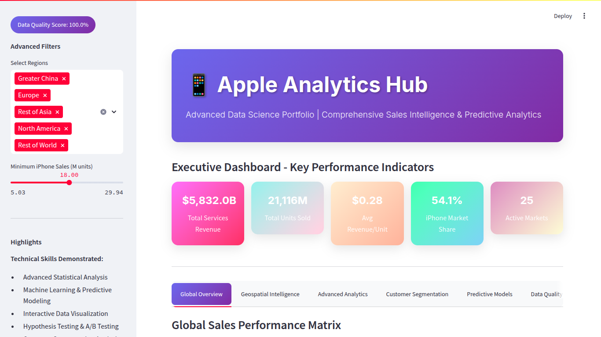
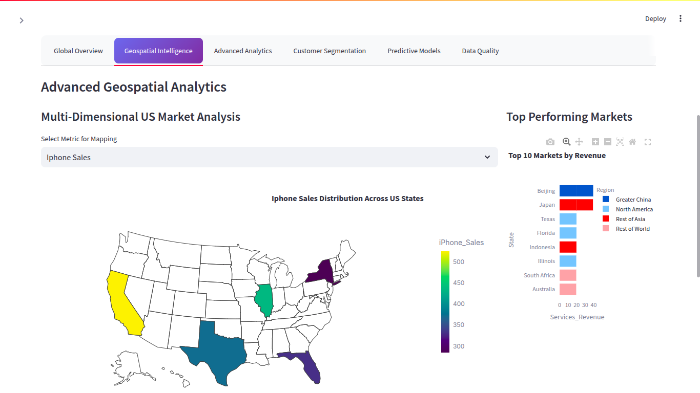
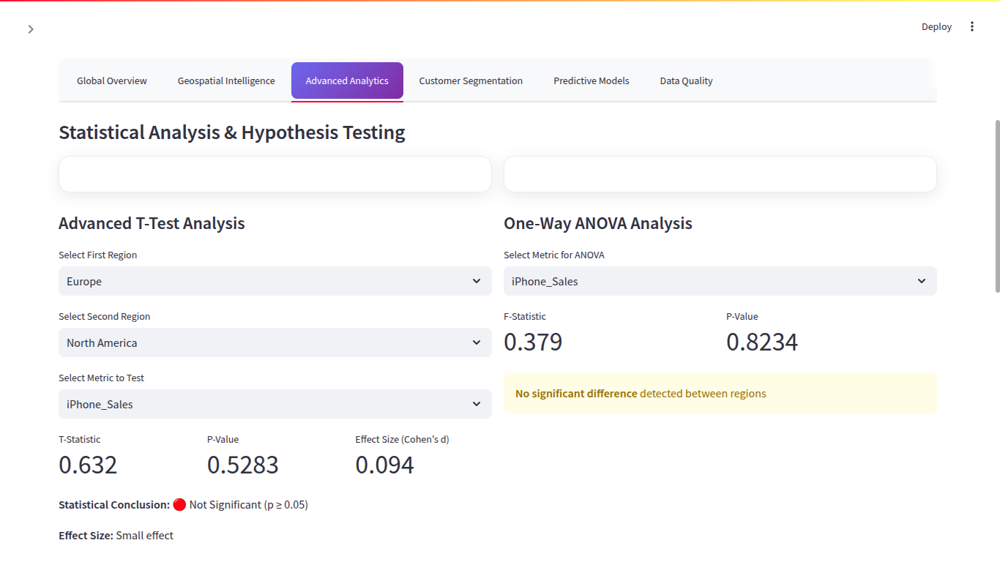
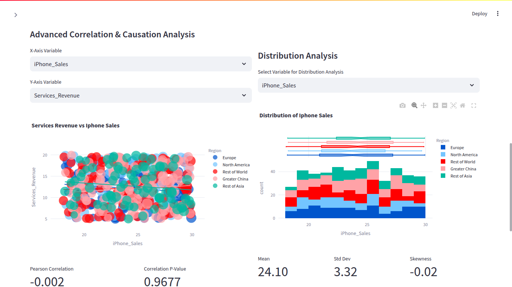
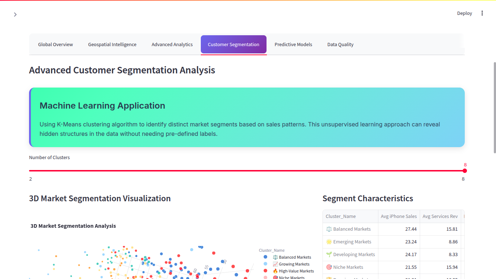
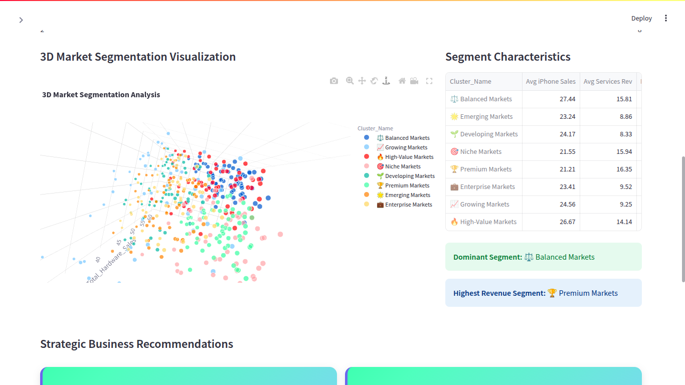
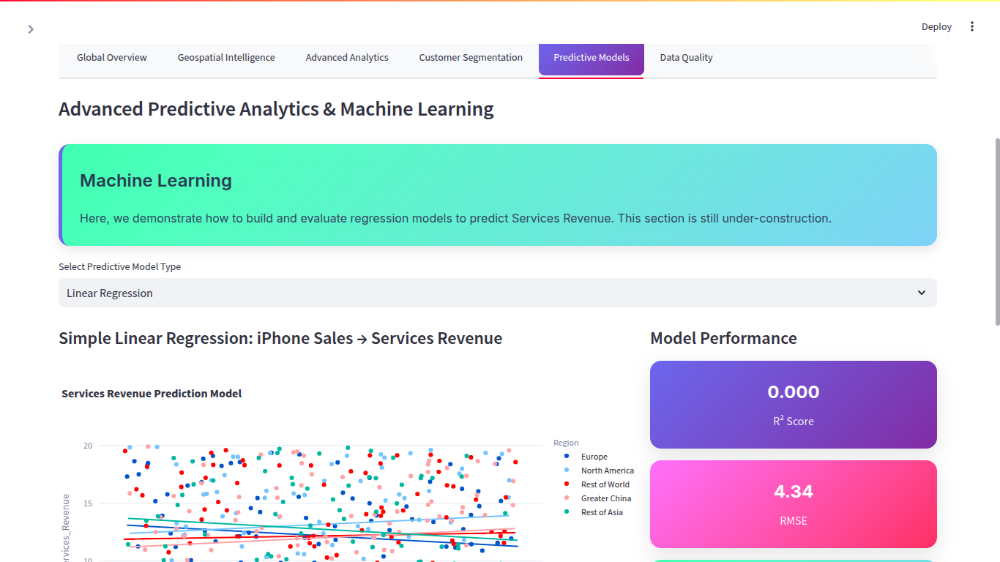
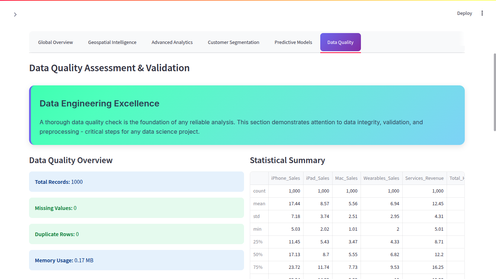
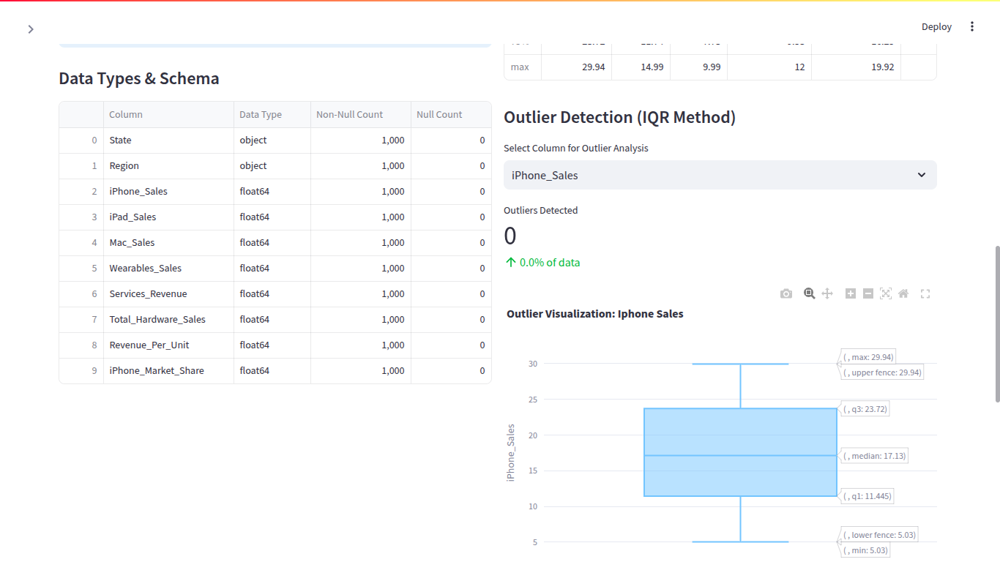

# Comprehensive-Data-Analysis-Visualization-of-Apple-Product-Sales

## Overview
This Python project analyzes Apple product sales data and builds predictive models to forecast sales performance. The application uses data visualization, clustering, predictive modeling, and a dashboard to summarize insights. It includes the following key features:

- Exploratory Data Analysis (EDA)
- Feature engineering and normalization
- Clustering analysis
- Predictive modeling using machine learning
- Hyperparameter tuning
- Interactive dashboard for visualization and insights

-----

## Installation and Usage

Follow these steps to run the dashboard locally:

### 1. Clone the Repository
```bash
git clone https://github.com/your-username/Comprehensive-Data-Analysis-Visualization-of-Apple-Product-Sales.git
```
```bash
cd Comprehensive-Data-Analysis-Visualization-of-Apple-Product-Sales
```
### 2. Install Dependencies: Make sure Python is installed on your system. Then, install the required packages:

```bash
pip install -r requirements.txt
```
### 3. Add Dataset: Place the apple_sales_2024.csv file in the root directory.

### 4. Run the App: Start the application server:

```bash
python3 -m streamlit run dash.py
```
### 4. Access the Dashboard: Open your browser and visit:

```bash
http://localhost:8501
```

-----

## Screenshots












-----

### Contributions are welcome! Feel free to fork the repository and submit a pull request.
