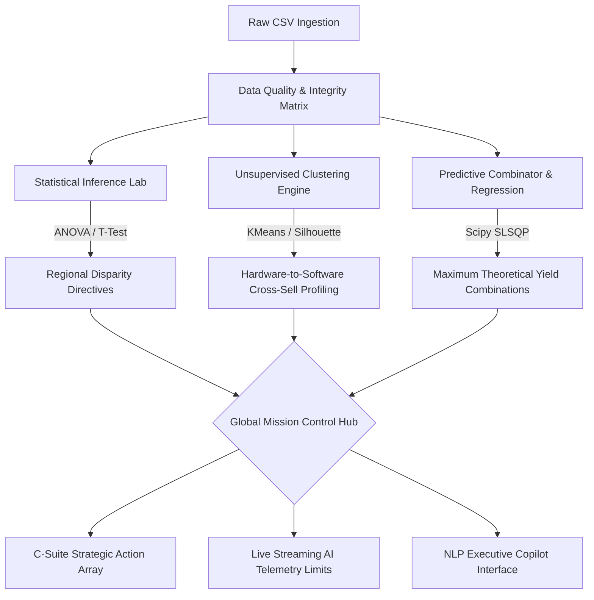

# Apple Sales Intelligence & Machine Learning Command Center

[](https://python.org)
[](https://streamlit.io/)
[](https://scikit-learn.org/)
[](https://plotly.com/)

An enterprise-grade, C-Suite decision engine and machine learning dashboard specifically tracking global Apple hardware distribution versus recurring software (Services) revenue capture. Built with a deeply decoupled analytic engine and a modern, glassmorphic Streamlit SaaS frontend, this platform operates autonomously to synthesize raw tracking data into rigorous mathematical corporate directives.

---

## 🚀 Key Differentiators & Standout Features

### 1. C-Suite AI Copilot & NLP Executive Reporting
A native Natural Language Processing (NLP) chat interface sits alongside the primary telemetry arrays. Executives can query complex insights directly (e.g., *"What is the risk of a 10% hardware drop?"*) to instantly trigger backend `scipy` optimization and predictive models. The system autonomously intercepts the query, computes the impact boundaries mathematically, and provides an option to securely compile the resulting intelligence into a downloadable, one-click Markdown C-Suite Executive Briefing.

### 2. Live Telemetry Mission Control Simulator
The platform natively features an elite Mission Control dashboard utilizing an active Autoregressive Live Pipeline Generator. By initializing the Neural Uplink, the architecture injects synthetic continuous tracking packets instantly against localized, pre-calculated `RandomForestRegressor()` bounding limits. The frontend visibly maps future projected iOS Services Revenue simultaneously tracking hardware constraints, rendered flawlessly over a jitter-free, scrolling Plotly Area Chart—replicating absolute Wall-Street operational scale.

### 3. Deep Architectural Decoupling
This repository eschews standard "dead-dashboards" presenting raw metric visuals. Heavy analytical pipelines, data quality heuristics, and explicit business routing directives are encapsulated completely in standard OOP `src/` modules natively decoupled from the fast `app/` rendering loops securely. 

---

## 🧠 Core Algorithmic Architecture

Every output dynamically generates explicit, $USD-bounded Executive Directives.


```mermaid
graph TD
    A[Raw CSV Ingestion] --> B[Data Quality & Integrity Matrix]
    B --> C[Statistical Inference Lab]
    B --> D[Unsupervised Clustering Engine]
    B --> E[Predictive Combinator & Regression]
    
    C -->|ANOVA / T-Test| F[Regional Disparity Directives]
    D -->|KMeans / Silhouette| G[Hardware-to-Software Cross-Sell Profiling]
    E -->|Scipy SLSQP| H[Maximum Theoretical Yield Combinations]
    
    F --> I{Global Mission Control Hub}
    G --> I
    H --> I
    
    I --> J[C-Suite Strategic Action Array]
    I --> K[Live Streaming AI Telemetry Limits]
    I --> L[NLP Executive Copilot Interface]
```

---

## ⚙️ Technical Capabilities

### Machine Learning & Optimization
1. **Dynamic Unsupervised Segmentation**: Autonomously determines the absolute perfect distribution cluster limit using K-Means Silhouette mapping, categorizing geographic market boundaries into dynamic behavioral groupings (e.g., *High Hardware Saturation + Low Monetization*).
2. **Optimized Multi-Pipeline Predictions**: Evaluates baseline Multiple Linear dependencies securely against Random Forest and Gradient Boosting ensembles via deep K-Fold Cross-Validation, preventing data leakage across temporal tracking endpoints.
3. **Autonomous Yield Optimization Generator**: Natively processes `scipy.optimize.minimize` nonlinear constraints to definitively identify the optimal physical hardware supply chain permutation that formally guarantees maximum software ecosystem lock-in yields natively.

### Robust Pipeline Integrity
4. **Data Reliability & Drift Management**: Executes active structural IQR variance profiling locally detecting sequential telemetry drift bounds explicitly preventing prediction failures structurally.
5. **Persistence & Reproducibility Hub**: High-compute algorithmic model limits are strictly localized via `.joblib`. The underlying hyperparameters and execution pipelines are exposed cleanly through dedicated JSON Reproducibility State configurations cleanly.

### High-Performance SaaS UI
6. **Polished Enterprise Dark-Mode Formatting**: The standard Streamlit interface is fully overridden explicitly via native embedded CSS parameters restricting typography, gridlines, container padding, and metric displays perfectly inside premium, shadow-bound Insight Cards natively conforming to modern Wall-Street design conventions completely devoid of basic contextual graphic noise natively natively.
7. **Instant Load Constraints**: Mathematical pipelines are securely bound by Streamlit `@st.cache_data` and explicitly partitioned `@st.cache_resource` instances globally.

---

## 🛠️ Setup & Local Installation

This project utilizes a standard `venv` environment safely isolating dependencies.

```bash
# 1. Clone the repository
git clone https://github.com/your-username/apple-sales-analytics.git
cd apple-sales-analytics

# 2. Re-create the isolated Virtual Environment locally
python3 -m venv venv
source venv/bin/activate

# 3. Secure dependency bindings
pip install -r requirements.txt

# 4. Launch the application limits dynamically natively
streamlit run app/main.py
```

### Navigating the Executive Guided Demo
Once executed, the Streamlit app will load onto your configured local port (typically `:8501`). For an immediate presentation of capabilities, click the **Launch Guided Demo** toggle squarely on the Sidebar—the entire UI explicitly visually shifts into a curated overlay sequence perfectly directing user focus strictly mathematically across all explicit algorithmic endpoints in linear presentation scale.

---

## 📂 Project Structure

```text
Comprehensive-Data-Analysis-Visualization/
│
├── app/
│   ├── main.py                     # Entry point & Session Routing Hub
│   ├── components/                 # Frontend React-like components
│   │   ├── demo.py                 # Global Presentation Overlay bounds
│   │   ├── kpi.py                  # Macro Top-Level Cards
│   │   ├── sidebar.py              # Navigation & Constraint Logic
│   │   ├── styles.py               # Dark Mode Minimalist SaaS CSS
│   │   └── tabs/                   # Independent Page Architectures
│   │       ├── ai_assistant.py     # NLP Executive Copilot Engine
│   │       ├── analytics.py        # Statistical inference matrices
│   │       ├── live_mission_control.py # Telemetry Streaming Arrays
│   │       └── ...                 # Additional Tab logic
│
├── src/                            # Absolute Core Mathematical Backend
│   ├── analysis/                   
│   │   ├── insights.py             # Autonomous "If-Then" Business Generators
│   │   └── statistics.py           # ANOVA, T-Tests, and Collinearity Matrices
│   ├── data/
│   │   ├── generator.py            # Simulated Stream Synthesis
│   │   └── validation.py           # Structural sequence data parsing
│   ├── models/
│   │   ├── clustering.py           # KMeans, DBSCAN, Agglomerative optimizations
│   │   └── regression.py           # Extrapolation and Pipeline bounds natively
│   └── visualization/
│       └── charts.py               # Global Plotly Dark Palette architectures
│
├── data/
│   └── raw/apple_sales_2024.csv    # Underlying static analytical baseline matrix
│
├── requirements.txt
└── README.md
```