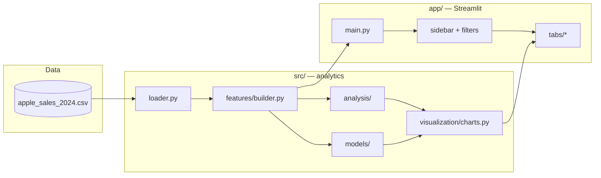
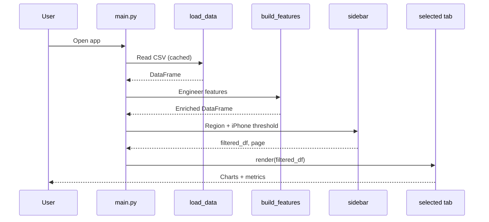
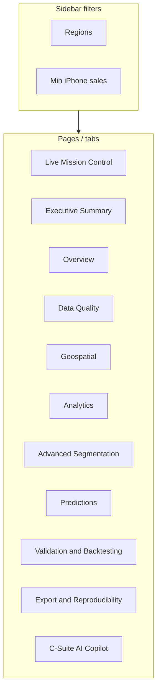
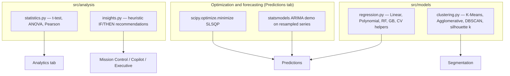

# Comprehensive Data Analysis & Visualization — Apple Product Sales

[](https://python.org)
[](https://streamlit.io)
[]()

A **Streamlit** dashboard for exploring regional Apple-style sales data: hardware units (iPhone, iPad, Mac, Wearables) and **Services revenue**, with **statistics**, **clustering**, **regression**, **constrained optimization**, and exportable artifacts. Analytics live in `src/`; the UI lives in `app/`.

---

## Visual overview

### High-level architecture


```mermaid
flowchart LR
    subgraph Data
        CSV[(apple_sales_2024.csv)]
    end

    subgraph src["src/ — analytics"]
        L[loader.py]
        F[features/builder.py]
        A[analysis/]
        M[models/]
        V[visualization/charts.py]
    end

    subgraph app["app/ — Streamlit"]
        MAIN[main.py]
        SB[sidebar + filters]
        TABS[tabs/*]
    end

    CSV --> L
    L --> F
    F --> A
    F --> M
    A --> V
    M --> V
    F --> MAIN
    MAIN --> SB
    SB --> TABS
    V --> TABS
```

### Request flow (single session)


```mermaid
sequenceDiagram
    participant User
    participant Main as main.py
    participant Load as load_data
    participant Feat as build_features
    participant Side as sidebar
    participant Tab as selected tab

    User->>Main: Open app
    Main->>Load: Read CSV (cached)
    Load-->>Main: DataFrame
    Main->>Feat: Engineer features
    Feat-->>Main: Enriched DataFrame
    Main->>Side: Region + iPhone threshold
    Side-->>Main: filtered_df, page
    Main->>Tab: render(filtered_df)
    Tab-->>User: Charts + metrics
```

### Dashboard views (navigation)


```mermaid
flowchart TB
    subgraph filters["Sidebar filters"]
        R[Regions]
        I[Min iPhone sales]
    end

    subgraph pages["Pages / tabs"]
        M[Live Mission Control]
        E[Executive Summary]
        O[Overview]
        DQ[Data Quality]
        G[Geospatial]
        AN[Analytics]
        S[Advanced Segmentation]
        P[Predictions]
        V[Validation and Backtesting]
        X[Export and Reproducibility]
        C[C-Suite AI Copilot]
    end

    filters --> pages
```

### Analytics stack (what runs under the hood)


```mermaid
flowchart TB
    subgraph stats["src/analysis"]
        ST[statistics.py — t-test, ANOVA, Pearson]
        IN[insights.py — heuristic IF/THEN recommendations]
    end

    subgraph models["src/models"]
        REG[regression.py — Linear, Polynomial, RF, GB, CV helpers]
        CLU[clustering.py — K-Means, Agglomerative, DBSCAN, silhouette k]
    end

    subgraph opt["Optimization and forecasting (Predictions tab)"]
        SC[scipy.optimize.minimize SLSQP]
        AR[statsmodels ARIMA demo on resampled series]
    end

    ST --> AN[Analytics tab]
    IN --> M1[Mission Control / Copilot / Executive]
    REG --> PRED[Predictions]
    CLU --> SEG[Segmentation]
    SC --> PRED
    AR --> PRED
```

---

## Features (what the app actually does)

| Area | Behavior |
|------|----------|
| **Data** | Single CSV at `data/raw/apple_sales_2024.csv`; columns normalized in `load_data()`. |
| **Features** | Total hardware sales, revenue per unit, iPhone share (`src/features/builder.py`). |
| **Statistics** | T-tests, one-way ANOVA, correlations (`src/analysis/statistics.py`). |
| **Clustering** | K-Means / hierarchical / DBSCAN; optional silhouette-based *k*; cluster narratives (`src/models/clustering.py`). |
| **Regression** | Linear, polynomial pipelines, Random Forest, Gradient Boosting; residual and actual-vs-predicted plots (`src/models/regression.py`). |
| **Optimization** | Constrained hardware-mix search maximizing predicted Services revenue via **SLSQP** (Predictions tab). |
| **Validation** | Cross-validation on a Random Forest pipeline (Validation tab). |
| **Export** | `joblib` model + JSON config + predictions CSV under `src/models/saved/` (Export tab). |
| **Copilot** | Chat UI routes keywords (e.g. risk, report, strategy) to the same metrics and `generate_business_recommendations()` — **not** a hosted LLM. |
| **Mission Control** | KPIs plus **synthetic** sparklines for illustration; not a live external telemetry feed. |
| **Guided demo** | Sidebar control locks navigation and walks through the workflow (`app/components/demo.py`). |

---

## Tech stack

| Package | Role |
|---------|------|
| `streamlit` | App shell, caching, widgets |
| `pandas` | Data handling |
| `plotly` | Interactive charts (`src/visualization/charts.py`) |
| `scikit-learn` | Regression, clustering, CV, pipelines |
| `scipy` | Statistical tests, constrained optimization |
| `statsmodels` | ARIMA (demonstration block in Predictions) |
| `numpy` | Numerics |

Pinned versions: see [`requirements.txt`](requirements.txt).

---

## Repository layout

```text
.
├── app/
│   ├── main.py                 # Entry: load → features → sidebar → KPIs → tab router
│   └── components/
│       ├── styles.py           # Custom CSS
│       ├── sidebar.py          # Filters, nav, demo launcher
│       ├── kpi.py
│       ├── demo.py             # Guided presentation overlay
│       └── tabs/               # One module per page (executive, overview, …)
├── src/
│   ├── data/
│   │   └── loader.py           # CSV load + data quality dict
│   ├── features/
│   │   └── builder.py          # Feature engineering
│   ├── analysis/
│   │   ├── statistics.py       # Inference helpers
│   │   └── insights.py         # Rule-based recommendations
│   ├── models/
│   │   ├── regression.py
│   │   ├── clustering.py
│   │   └── saved/              # Created when you use Export (joblib, etc.)
│   └── visualization/
│       └── charts.py           # Plotly helpers + dark styling
├── data/raw/
│   └── apple_sales_2024.csv
├── CASE_STUDY.md               # Extended narrative (case study)
├── Comprehensive Data Analysis and Visualization of Apple Product Sales.ipynb
├── requirements.txt
└── README.md
```

---

## Setup

```bash
git clone <repository-url>
cd Comprehensive-Data-Analysis-Visualization-of-Apple-Product-Sales

python3 -m venv venv
source venv/bin/activate          # Windows: venv\Scripts\activate

pip install -r requirements.txt
streamlit run app/main.py
```

Open the URL shown in the terminal (typically `http://localhost:8501`). Use **Launch Guided Demo** in the sidebar for a scripted walkthrough.

---

## Notes on interpretation

- **Recommendation text and dollar figures** in insights are **heuristic** (linear shortcuts and scaling); use them as discussion prompts, not audited forecasts.
- **ARIMA** in the Predictions tab uses a **resampled** series when true dates are absent — it illustrates the API, not a fiscal calendar.
- For generalization, prefer **cross-validated** metrics on the Validation tab over in-sample R² alone.

---

## Related docs

- **[CASE_STUDY.md](CASE_STUDY.md)** — Problem framing, design choices, and extended context.
- **Notebook** — `Comprehensive Data Analysis and Visualization of Apple Product Sales.ipynb` for exploratory or teaching workflows alongside the app.
